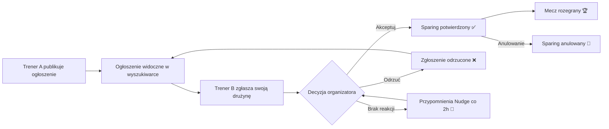

# Cykl życia sparingu

> Jak sparing przechodzi od ogłoszenia do rozegranego (lub anulowanego) meczu.

## Przebieg w skrócie

## Etapy krok po kroku

### 1. Publikacja ogłoszenia
Organizator (trener A) tworzy sparing: wybiera drużynę, datę, godzinę, lokalizację, poziom.
Drużyna organizatora otrzymuje w sparingu rolę **Organizator** (Admin). Ogłoszenie od razu
pojawia się w wyszukiwarce innych trenerów.

Przy sparingu **cyklicznym** system generuje całą serię wydarzeń (co tydzień, do wskazanej
daty końcowej, maks. 25 wystąpień) — każde jako niezależne ogłoszenie z własnym cyklem życia.

### 2. Zgłoszenie chętnego
Trener B znajduje ogłoszenie i zgłasza swoją drużynę. Zgłoszenie otrzymuje status
**Oczekujące** (Pending). Organizator dostaje powiadomienie push „chce wziąć udział w sparingu".

Zabezpieczenia systemowe:
- nie można zgłosić się na własny sparing,
- nie można zgłosić tej samej drużyny dwa razy,
- nie można zgłosić się, gdy limit uczestników jest już osiągnięty.

### 3. Decyzja organizatora
Organizator w widoku Moje sparingi (lub prosto z powiadomienia):
- **Akceptuje** → status zgłoszenia zmienia się na **Potwierdzone** (Confirmed);
  trener B dostaje push „zaakceptował Twój udział w sparingu";
- **Odrzuca** → status **Odrzucone** (Rejected); trener B dostaje powiadomienie,
  a sparing wraca do puli dostępnych (jeśli ma wolne miejsca).

### 4. Przypomnienia przy braku reakcji (system „Nudge")
Jeśli organizator nie odpowiada na oczekujące zgłoszenie, serwer **co 2 godziny**
wysyła mu przypomnienie push (dotyczy najstarszego oczekującego zgłoszenia).
Treść losowana z trzech wariantów, np.:

> „Trener Jan Kowalski czeka na Twoją odpowiedź w sprawie sparingu! Nie daj mu czekać –
> daj znać, czy termin Ci odpowiada."

### 5. Sparing potwierdzony
Obie strony widzą sparing jako potwierdzony (zielony w kalendarzu). Trenerzy dogrywają
szczegóły na czacie; lokalizacja jest klikalna — otwiera nawigację w mapach.

### 6. Anulowanie
Potwierdzony sparing może zostać anulowany — druga strona dostaje powiadomienie
„X anulował sparing Y". Anulowanie następuje też automatycznie przy usunięciu drużyny
zaangażowanej w sparing (po potwierdzeniu ostrzeżenia przez trenera).

## Statusy sparingu widziane w aplikacji

W wyszukiwarce każdy cudzy sparing ma jeden ze statusów:

| Status | Znaczenie dla trenera |
|---|---|
| **Dostępny** (Available) | Można się zgłosić — są wolne miejsca |
| **Rywal znaleziony!** | Limit uczestników osiągnięty; ogłoszenie widoczne do terminu wydarzenia |
| **Już uczestniczysz** | Twoja drużyna została potwierdzona w tym sparingu |
| **Oczekuje na potwierdzenie** | Twoje zgłoszenie czeka na decyzję organizatora |

W kalendarzu i na liście „Moje" sparingi dzielą się na:

| Grupa | Opis |
|---|---|
| Przeszłe | Wydarzenia, których termin już minął |
| Zaplanowane, bez chętnych | Opublikowane ogłoszenia czekające na zgłoszenia |
| Do akceptacji / czekające na akceptację | Ktoś się zgłosił i czeka na Twoją decyzję — lub Ty czekasz na cudzą |
| Potwierdzone | Finalnie umówione mecze |
| Anulowane / odrzucone | Wydarzenia odwołane lub zgłoszenia odrzucone |

## Statusy zgłoszenia drużyny (pod maską)

Każda drużyna w sparingu ma jedną z relacji:

| Relacja | Kto | Jak powstaje |
|---|---|---|
| **Organizator** (Admin) | Drużyna trenera, który utworzył sparing | Automatycznie przy utworzeniu |
| **Oczekująca** (Pending) | Drużyna, która się zgłosiła | Po kliknięciu „Zgłoś się" |
| **Potwierdzona** (Confirmed) | Drużyna przyjęta do sparingu | Po akceptacji organizatora |
| **Odrzucona** (Rejected) | Drużyna, której zgłoszenie odrzucono | Po odrzuceniu przez organizatora |

## Reguły edycji i usuwania

| Operacja | Warunek | Uzasadnienie biznesowe |
|---|---|---|
| **Edycja sparingu** | Brak zgłoszeń oczekujących i potwierdzonych | Nie można zmieniać warunków „pod" trenerami, którzy już zareagowali |
| **Usunięcie sparingu** | Brak uczestników poza organizatorem | Jak wyżej — ochrona rozpoczętych relacji |
| **Zmniejszenie limitu uczestników (turniej)** | Nowy limit ≥ liczba potwierdzonych drużyn | Nie można „wyprosić" już przyjętych drużyn |
| **Usunięcie drużyny z aktywnymi sparingami** | Wymaga jawnego potwierdzenia ostrzeżenia | Uczestnicy dostają powiadomienia, powiązane sparingi organizowane przez drużynę są usuwane |

## Sparing kontra turniej

| Cecha | Sparing | Turniej |
|---|---|---|
| Liczba uczestników | Organizator + 1 drużyna | Organizator + dowolna liczba drużyn (limit ustala organizator) |
| Zgłoszenia | Pierwsze zaakceptowane zgłoszenie „zamyka" sparing | Wiele drużyn może być zaakceptowanych aż do limitu |
| Powiadomienia | Te same typy, z rozróżnieniem treści „sparing"/„turniej" | |
