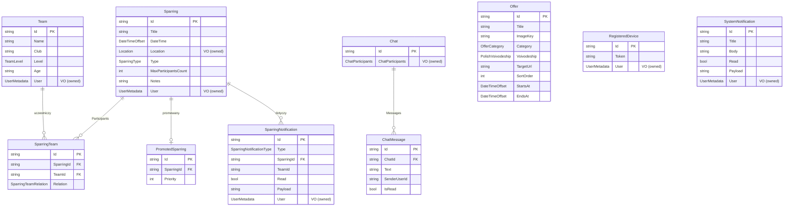
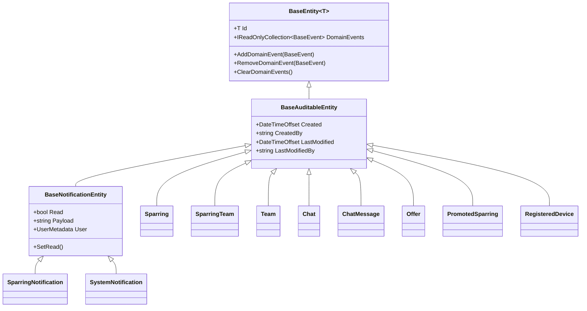

# Model domeny

Warstwa `SparingiPro.Domain` (`src/backend/src/Domain/`) zawiera encje, obiekty wartości (value objects), enumy, zdarzenia domenowe oraz stałe walidacyjne. Nie zależy od frameworków infrastrukturalnych — jedyne zależności to `ErrorOr` (wzorzec Result) oraz `MediatR` (interfejs `INotification` dla zdarzeń domenowych). Przestrzenie nazw domeny są importowane globalnie w `GlobalUsings.cs`.

## Klasy bazowe (`Common/`)

| Klasa | Opis |
|---|---|
| `BaseEntity<T>` | Bazowa encja z kluczem `Id` typu `T` oraz kolekcją zdarzeń domenowych (`DomainEvents`, `AddDomainEvent`, `RemoveDomainEvent`, `ClearDomainEvents`). Kolekcja zdarzeń oznaczona `[NotMapped]`. |
| `BaseAuditableEntity` | Dziedziczy z `BaseEntity<string>` (klucz typu `string`). Dodaje pola audytu: `Created`, `CreatedBy`, `LastModified`, `LastModifiedBy`. Wszystkie `DateTimeOffset` przechowywane w UTC. |
| `BaseNotificationEntity` | Dziedziczy z `BaseAuditableEntity`. Wspólna baza powiadomień: `Read`, `Payload`, `User` (`UserMetadata`) oraz metoda `SetRead()`. |
| `ValueObject` | Bazowa klasa obiektów wartości — równość strukturalna przez `GetEqualityComponents()` (wzorzec z dokumentacji Microsoft DDD). |
| `BaseEvent` | Abstrakcyjny rekord zdarzenia domenowego, implementuje `MediatR.INotification`. |

## Encje (`Entities/`)

### Sparring
Centralna encja — reprezentuje sparing lub turniej (`SparringType`).

Właściwości: `Title`, `DateTime` (UTC), `Location` (VO), `Type`, `MaxParticipantsCount`, `Notes`, `User` (`UserMetadata` — twórca), `Participants` (kolekcja `SparringTeam`).

Właściwości wyliczane: `AdministratorTeam` (uczestnik z relacją `Admin`), `CurrentParticipantsCount` (= liczba potwierdzonych + 1), `Available` (czy są wolne miejsca), `ConfirmedParticipants`, `RejectedParticipants`, `PendingParticipants` (filtrowanie `Participants` po `Relation`).

Metody fabryczne i biznesowe (wszystkie zwracają `ErrorOr<...>`):
- `CreateSparring(...)` — tworzy sparing (`Type = Sparring`, `MaxParticipantsCount = 2`), dodaje drużynę administratora jako uczestnika `Admin`.
- `CreateTournament(...)` — tworzy turniej z konfigurowalnym `MaxParticipantsCount`.
- `UpdateSparring(...)` / `UpdateTournament(...)` — aktualizacja; turniej waliduje, czy nowy limit nie jest mniejszy od bieżącej liczby uczestników (`ExceededMaxParticipants`); wymienia relację `Admin`.
- `AddPendingParticipant(Team)` — waliduje limit miejsc i duplikat zgłoszenia (`AlreadyPendingParticipant`); emituje `PendingParticipantCreatedEvent`.
- `ConfirmParticipant(Team)` — waliduje limit, duplikat potwierdzenia i istnienie zgłoszenia; emituje `ParticipantConfirmedEvent`.
- `RejectParticipant(Team)` — analogicznie; emituje `ParticipantRejectedEvent`.

Data i godzina są łączone z `DateOnly` + `TimeOnly` w `DateTimeOffset` z lokalnym offsetem (prywatna metoda `Create`).

### SparringTeam
Encja łącząca (`Sparring` ↔ `Team`) ze stanem relacji `SparringTeamRelation`.

Właściwości: `SparringId`, `Sparring`, `TeamId`, `Team`, `Relation`.

Metody: `CreatePending(sparring, team)`, `CreateAdmin(sparring, team)` (fabryki), `Confirm()` (`Pending → Confirmed`), `Reject()` (`Pending → Rejected`); przejście z innego stanu zwraca błąd walidacji `AlreadyConfirmedParticipant`.

### Team
Drużyna trenera: `Name`, `Club`, `Level` (`TeamLevel`), `Age`, `User` (`UserMetadata` — właściciel). Metody: `Create(...)`, `Update(...)`.

### Chat
Czat 1:1 w kontekście sparingu. Właściwości: `ChatParticipants` (VO), `Messages` (kolekcja `ChatMessage`), wyliczane `LastMessage` (najnowsza wiadomość wg `Created`).

Metody:
- `Create(Sparring, UserMetadata)` — blokuje czat z samym sobą (`CantSendMessageToSelf`).
- `Create(SparringTeam)` — czat na podstawie relacji sparing–drużyna.
- `CreateMessage(senderUserId, text)` — dodaje wiadomość i emituje `ChatMessageCreatedEvent`.
- `IsRead(userId)` / `SetRead(userId)` — status przeczytania wiadomości cudzych.

### ChatMessage
Wiadomość czatu: `ChatId`, `Chat`, `Text`, `SenderUserId`, `IsRead` (domyślnie `false`). Fabryka `Create` jest `internal` — wiadomości tworzone tylko przez `Chat.CreateMessage`.

### Offer
Oferta partnerska (marketplace): `Title`, `Description`, `ImageKey`, `Category` (`OfferCategory`), `Voivodeship` (`PolishVoivodeship?`), `TargetUrl`, `SortOrder`, `StartsAt`, `EndsAt`.

Metody: `Create(...)` i `Update(...)` walidują `EndsAt > StartsAt` (`EndsAtMustBeAfterStartsAt`); `ReplaceImage(newImageKey)`.

### PromotedSparring
Wyróżnienie sparingu: `SparringId`, `Sparring`, `Priority`. Brak metod biznesowych.

### RegisteredDevice
Urządzenie do powiadomień push: `Token`, `User` (`UserMetadata`). Metody: `Create(...)`, `Update(...)`.

### SparringNotification
Powiadomienie o sparingu (dziedziczy z `BaseNotificationEntity`): `Type` (`SparringNotificationType`), `SparringId`, `Sparring`, `TeamId`.

Metody: `Create(...)`; `SetConfirmed()` (`SparringRequest → SparringAcceptedByMe`, `TournamentRequest → TournamentAcceptedByMe`) i `SetRejected()` (analogicznie `...RejectedByMe`) — obie resetują `Read = false`.

### SystemNotification
Powiadomienie systemowe (dziedziczy z `BaseNotificationEntity`): `Title`, `Body`. Fabryka `Create(...)`.

## Obiekty wartości (`ValueObjects/`)

| Value Object | Pola | Uwagi |
|---|---|---|
| `UserMetadata` | `Id`, `Email`, `FirstName`, `LastName` | Zdenormalizowana migawka użytkownika Identity, osadzana w encjach (owned type). |
| `Location` | `Coordinate` (`LocationCoordinate`), `Address` (`LocationAddress`) | Lokalizacja sparingu. |
| `LocationCoordinate` | `Latitude`, `Longitude` | Współrzędne geograficzne. |
| `LocationAddress` | `City`, `Country`, `Name`, `State`, `StreetName`, `ZipCode` | Adres pocztowy. |
| `ChatParticipants` | `SparringId`, `SparringTitle`, `AdministratorUser`, `ParticipantUser` (oba `UserMetadata`) | Fabryki: `Create(Sparring, UserMetadata)` i `Create(SparringTeam)`. |

## Enumy (`Enums/`)

| Enum | Wartości |
|---|---|
| `SparringType` | `Sparring = 1`, `Tournament = 2` |
| `SparringTeamRelation` | `Pending = 1`, `Confirmed = 2`, `Admin = 3`, `Rejected = 4` |
| `TeamLevel` | `Amateur = 1`, `Intermediate = 2`, `Pro = 3` |
| `CycleType` | `Weekly = 1` (sparingi cykliczne) |
| `SparringNotificationType` | 14 wartości: `SparringRequest`, `TournamentRequest`, `SparringAccepted`, `TournamentAccepted`, `SparringRejected`, `TournamentRejected`, `SparringAcceptedByMe`, `TournamentAcceptedByMe`, `SparringRejectedByMe`, `TournamentRejectedByMe`, `SparringNudge`, `TournamentNudge`, `SparringCancelled`, `TournamentCancelled` |
| `OfferCategory` | 14 wartości: `Awards`, `PhotoVideo`, `Transport`, `Lodging`, `CampsPoland`, `CampsAbroad`, `FootballClothing`, `TrainingEquipment`, `ClubAccessories`, `FootballFootwear`, `AttractionsRental`, `IndividualTraining`, `Physiotherapy`, `Conferences` |
| `PolishVoivodeship` | 16 województw (`DolnoSlaskie = 1` … `Zachodniopomorskie = 16`) |

## Zdarzenia domenowe (`Events/`)

Wszystkie dziedziczą z `BaseEvent` (`MediatR.INotification`); obsługiwane przez handlery w warstwie Application.

| Zdarzenie | Ładunek | Emitowane przez |
|---|---|---|
| `PendingParticipantCreatedEvent` | `Sparring`, `PendingParticipant` (`Team`) | `Sparring.AddPendingParticipant` |
| `ParticipantConfirmedEvent` | `Sparring`, `ConfirmedParticipant` (`Team`) | `Sparring.ConfirmParticipant` |
| `ParticipantRejectedEvent` | `Sparring`, `ConfirmedParticipant` (`Team`) | `Sparring.RejectParticipant` |
| `ChatMessageCreatedEvent` | `Chat`, `Message` (`ChatMessage`) | `Chat.CreateMessage` |
| `TeamDeletedEvent` | `Team`, `AffectedUsers` (lista `AffectedSparringUser`: `UserId`, `SparringTitle`, `SparringType`, `TeamName`) | warstwa Application (usuwanie drużyny) |

## Stałe (`Constants/`, `Validation/`)

- `Roles`: `Trainer`, `Administrator`.
- `Policies`: `CanPurge`.
- `ValidationConstants` — klucze błędów walidacji (tłumaczone po stronie klienta), np. `validation.sparrings.max_participants_exceeded`, `validation.chats.cant_send_message_to_self`, `validation.users.email_already_exists`, `validation.offers.ends_at_must_be_after_starts_at`.
- `NotFoundConstants` — klucze błędów 404, np. `not_found.sparrings.not_found`, `not_found.teams.not_found`, `not_found.chats.not_found`, `not_found.offers.not_found`.

## Diagram ERD

Uwagi do diagramu:
- Wszystkie encje dziedziczą z `BaseAuditableEntity` — mają dodatkowo `Created`, `CreatedBy`, `LastModified`, `LastModifiedBy` (pominięte dla czytelności).
- `UserMetadata`, `Location`, `ChatParticipants` to obiekty wartości osadzane w encjach (nie osobne tabele z relacjami FK do użytkownika Identity) — powiązanie z użytkownikiem odbywa się przez zdenormalizowane `User.Id`.
- `Chat` wiąże się ze sparingiem logicznie przez `ChatParticipants.SparringId` (bez fizycznego FK w modelu domeny).

## Diagram hierarchii klas bazowych

## Wyjątki (`Exceptions/`)

- `UnsupportedColourException` — pozostałość po szablonie Clean Architecture (Jason Taylor); nieużywana w logice biznesowej.
