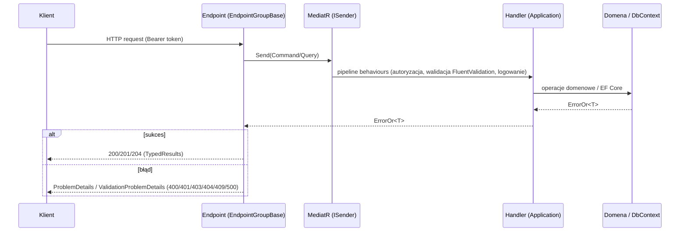

# API (warstwa Web)

Projekt `SparingiPro.Web` (`src/backend/src/Web/`) to host Minimal API. Endpointy są pogrupowane w klasy dziedziczące z `EndpointGroupBase` i automatycznie rejestrowane przy starcie aplikacji.

## Mechanizm rejestracji endpointów

- Każda grupa endpointów to klasa dziedzicząca z `EndpointGroupBase` (`Web/Infrastructure/EndpointGroupBase.cs`) z metodą `Map(WebApplication app)`.
- `WebApplicationExtensions.MapEndpoints()` (wywoływane w `Program.cs`) skanuje assembly przez refleksję i mapuje wszystkie grupy.
- `app.MapGroup(this)` wyprowadza prefiks trasy z nazwy klasy: klasa `Sparrings` → prefiks `/api/Sparrings` (plus `WithGroupName` i `WithTags` dla OpenAPI).
- Rozszerzenia `MapGet/MapPost/MapPut/MapDelete` (`IEndpointRouteBuilderExtensions`) nadają endpointowi nazwę z nazwy metody handlera (`WithName`).
- Handlery wysyłają komendy/zapytania przez `ISender` (MediatR) — wzorzec CQRS. Wyniki `ErrorOr<T>` mapowane są przez `result.Match(TypedResults..., Problem)`.

## Uwierzytelnianie i autoryzacja

- Uwierzytelnianie: ASP.NET Core Identity z tokenami Bearer (`IdentityConstants.BearerScheme`); logowanie może opcjonalnie użyć cookies (`useCookies`, `useSessionCookies`).
- Wszystkie grupy poza `Users` i `SystemInfo` wymagają autoryzacji (`RequireAuthorization()` na całej grupie). W grupie `Users` autoryzacji wymaga tylko podgrupa `/manage`.
- Role domenowe: `Trainer` (nadawana przy rejestracji), `Administrator`. Polityka: `CanPurge`.
- Swagger UI (NSwag) przyjmuje nagłówek `Authorization: Bearer {token}` (schemat "JWT" w konfiguracji `AddOpenApiDocument`).

## Format błędów

- `EndpointGroupBase.Problem(List<Error>)` mapuje błędy `ErrorOr`:
  - wszystkie błędy typu `Validation` → `TypedResults.ValidationProblem` (HTTP 400, `HttpValidationProblemDetails`, słownik `errors` z kluczami typu `validation.title`),
  - pierwszy błąd innego typu → `TypedResults.Problem` z kodem: `Conflict` → 409, `Validation` → 400, `NotFound` → 404, `Unauthorized` → 401, `Forbidden` → 403, pozostałe → 500; `title` = opis błędu (klucz tłumaczenia, np. `not_found.sparrings.not_found`).
- `CustomExceptionHandler` (zarejestrowany przez `AddExceptionHandler` + `UseExceptionHandler`) obsługuje wyjątki: `UnauthorizedAccessException` → 401, `ForbiddenAccessException` → 403 (odpowiedź `ProblemDetails`).

## OpenAPI / Swagger

- Dokument OpenAPI generowany przez NSwag tylko poza środowiskiem `Production` (`AddOpenApiDocument`, tytuł "SparingiPro API").
- Swagger UI dostępne pod `/api`, dokument pod `/api/specification.json`; `/` przekierowuje na `/api`.
- W trybie `Debug` po udanym buildzie target MSBuild `NSwag` (w `Web.csproj`) uruchamia `config.nswag` i zapisuje specyfikację do `src/Web/wwwroot/api/specification.json` (OpenAPI 3, camelCase).

## Pozostałe elementy pipeline (`Program.cs`)

`UseHsts` (poza Development) → `InitialiseDatabaseAsync` (migracje + seed) → `UseHealthChecks("/health")` (health check z `AddDbContextCheck<ApplicationDbContext>`) → `UseHttpsRedirection` → `UseStaticFiles` → Swagger UI (poza Production) → `UseExceptionHandler` → `MapEndpoints`.

## Endpointy

Wspólne konwencje: odpowiedzi listujące to `PaginatedList<T>`; parametry zapytań GET wiązane przez `[AsParameters]`; błędy walidacji zwracają `HttpValidationProblemDetails`.

### Sparrings — `/api/Sparrings` (autoryzacja wymagana)

| Metoda | Ścieżka | Handler | Żądanie | Odpowiedź |
|---|---|---|---|---|
| GET | `/api/Sparrings` | `GetSparrings` | `GetSparringsQuery` (query) | 200 `PaginatedList<SparringDto>` |
| GET | `/api/Sparrings/map/points` | `GetSparringMapPoints` | `GetSparringMapPointsQuery` (query) | 200 `List<SparringMapPointDto>` |
| GET | `/api/Sparrings/my/map/points` | `GetMySparringMapPoints` | `GetMySparringMapPointsQuery` (query) | 200 `List<SparringMapPointDto>` |
| GET | `/api/Sparrings/my` | `GetMySparrings` | `GetMySparringsQuery` (query) | 200 `PaginatedList<SparringDto>` |
| GET | `/api/Sparrings/{id}` | `GetSparring` | `id` (route) | 200 `SparringDto`, 404 |
| POST | `/api/Sparrings` | `CreateSparring` | `CreateSparringCommand` (body) | 201 `CreateSparringResult`, 400 |
| POST | `/api/Sparrings/{sparringId}/participate/{teamId}` | `Participate` | route | 204, 400 |
| POST | `/api/Sparrings/{sparringId}/confirm/{teamId}` | `ConfirmParticipation` | route | 204, 400 |
| POST | `/api/Sparrings/{sparringId}/reject/{teamId}` | `RejectParticipation` | route | 204, 400 |
| GET | `/api/Sparrings/{sparringId}/participants` | `GetParticipants` | `GetParticipationsQuery` (query) | 200 `PaginatedList<ParticipationDto>` |
| PUT | `/api/Sparrings/{id}` | `UpdateSparring` | `UpdateSparringCommand` (body; `id` musi zgadzać się z `command.Id`) | 204, 400 |
| DELETE | `/api/Sparrings/{id}` | `DeleteSparring` | `id` (route) | 204, 400 |

### Teams — `/api/Teams` (autoryzacja wymagana)

| Metoda | Ścieżka | Handler | Żądanie | Odpowiedź |
|---|---|---|---|---|
| GET | `/api/Teams` | `GetTeams` | `GetTeamsQuery` (query) | 200 `PaginatedList<TeamDto>` |
| GET | `/api/Teams/{id}` | `GetTeam` | `id` (route) | 200 `TeamDto`, 404 |
| POST | `/api/Teams` | `CreateTeam` | `CreateTeamCommand` (body) | 201, 400 |
| PUT | `/api/Teams/{id}` | `UpdateTeam` | `UpdateTeamCommand` (body; `id` = `command.Id`) | 204, 400 |
| DELETE | `/api/Teams/{id}?confirmed=` | `DeleteTeam` | `id` (route), `confirmed` (query) | 200 `DeletionResultDto`, 400 |

Usunięcie drużyny z aktywnymi sparingami wymaga potwierdzenia (`confirmed=true`); w przeciwnym razie zwracany jest błąd walidacji `validation.teams.will_delete_active_sparrings`.

### Chats — `/api/Chats` (autoryzacja wymagana)

| Metoda | Ścieżka | Handler | Żądanie | Odpowiedź |
|---|---|---|---|---|
| GET | `/api/Chats/my` | `GetMyChats` | `GetMyChatsQuery` (query) | 200 `PaginatedList<ChatDto>` |
| GET | `/api/Chats/{id}` | `GetChat` | `id` (route) | 200 `ChatDto`, 400 |
| GET | `/api/Chats/messages` | `GetChatMessages` | `GetChatMessagesQuery` (query) | 200 `PaginatedList<ChatMessageDto>`, 400 |
| POST | `/api/Chats/send` | `SendMessage` | `SendMessageCommand` (body) | 204, 400 |
| POST | `/api/Chats/read` | `MarkMessageRead` | `MarkReadCommand` (body) | 204, 400 |

### Notifications — `/api/Notifications` (autoryzacja wymagana)

| Metoda | Ścieżka | Handler | Żądanie | Odpowiedź |
|---|---|---|---|---|
| GET | `/api/Notifications/@types` | `GetNotificationTypes` | — | 204 (endpoint techniczny — eksponuje typy `ChatMessagePushNotification` i `SparringPushNotification` w OpenAPI) |
| GET | `/api/Notifications/my` | `GetMyNotifications` | `GetMyNotificationsQuery` (query) | 200 `PaginatedList<NotificationDto>` |
| POST | `/api/Notifications/read` | `MarkNotificationsRead` | — | 204, 400 |
| POST | `/api/Notifications/register` | `RegisterDevice` | `RegisterDeviceCommand` (body) | 204, 400 |
| POST | `/api/Notifications/unregister` | `UnregisterDevice` | `UnregisterDeviceCommand` (body) | 204, 400 |

### Calendar — `/api/Calendar` (autoryzacja wymagana)

| Metoda | Ścieżka | Handler | Żądanie | Odpowiedź |
|---|---|---|---|---|
| GET | `/api/Calendar/my` | `GetMyCalendar` | — | 200 `IReadOnlyCollection<CalendarDto>` |

### Offers — `/api/Offers` (autoryzacja wymagana)

| Metoda | Ścieżka | Handler | Żądanie | Odpowiedź |
|---|---|---|---|---|
| GET | `/api/Offers` | `GetActiveOffers` | `GetActiveOffersQuery` (query) | 200 `PaginatedList<OfferDto>` |

### SystemInfo — `/api/SystemInfo` (bez autoryzacji)

| Metoda | Ścieżka | Handler | Żądanie | Odpowiedź |
|---|---|---|---|---|
| GET | `/api/SystemInfo` | `GetSystemInfo` | — | 200 `SystemInfoDto` |

### Users (Identity) — `/api/Users`

Grupa `Users` mapuje niestandardowe API Identity (`MapCustomIdentityApi` w `Web/Endpoints/User/IdentityApiBuilderExtensions.cs`) — zmodyfikowana kopia `MapIdentityApi` z ASP.NET Core, dostosowana do `ApplicationUser` (pola `FirstName`, `LastName`, `LicenseNumber`, `PhoneNumber`).

Endpointy publiczne (bez autoryzacji):

| Metoda | Ścieżka | Żądanie | Odpowiedź | Uwagi |
|---|---|---|---|---|
| POST | `/api/Users/register` | `RegisterUserCommand` (body): `Email`, `Password`, `FirstName`, `LastName`, `LicenseNumber`, `PhoneNumber` | 200, 400 `ValidationProblem` | Waliduje e-mail; duplikat e-maila zwraca klucz `validation.users.email_already_exists`. Nadaje rolę `Trainer` i wysyła e-mail potwierdzający. |
| POST | `/api/Users/login?useCookies=&useSessionCookies=` | `LoginRequest` (body): `Email`, `Password`, opcjonalnie `TwoFactorCode` / `TwoFactorRecoveryCode` | 200 `AccessTokenResponse` (bearer) lub cookie; 401 `ProblemDetails` | Schemat bearer domyślnie; cookies gdy `useCookies`/`useSessionCookies=true`. Obsługa 2FA. |
| POST | `/api/Users/refresh` | `RefreshRequest` (body): `RefreshToken` | 200 `AccessTokenResponse`, 401 | Odrzuca wygasłe tokeny i nieaktualny security stamp. |
| GET | `/api/Users/confirmEmail?userId=&code=&changedEmail=` | query | 200 (tekst), 401 | Potwierdza e-mail lub zmianę e-maila (wraz z aktualizacją nazwy użytkownika). |
| POST | `/api/Users/resendConfirmationEmail` | `ResendConfirmationEmailRequest` (body): `Email` | 200 | Zawsze 200 (nie ujawnia istnienia konta). |
| POST | `/api/Users/forgotPassword` | `ForgotPasswordRequest` (body): `Email` | 200 | Wysyła link `{AppSchema}://reset-password?code=...` (deep link aplikacji mobilnej; `AppSchema` z konfiguracji) tylko dla istniejących kont z potwierdzonym e-mailem; zawsze 200. |
| POST | `/api/Users/resetPassword` | `ResetPasswordRequest` (body): `Email`, `ResetCode`, `NewPassword` | 200, 400 `ValidationProblem` | Nieprawidłowy token → błąd `InvalidToken`. |

Endpointy zarządzania kontem — podgrupa `/api/Users/manage` (autoryzacja wymagana):

| Metoda | Ścieżka | Żądanie | Odpowiedź | Uwagi |
|---|---|---|---|---|
| DELETE | `/api/Users/manage/delete` | — | 204, 400, 404 | Wysyła `PurgeUserContentCommand` (czyszczenie danych użytkownika), po czym blokuje konto (lockout +100 lat) — soft delete. |
| POST | `/api/Users/manage/2fa` | `TwoFactorRequest` (body): `Enable`, `TwoFactorCode`, `ResetSharedKey`, `ResetRecoveryCodes`, `ForgetMachine` | 200 `TwoFactorResponse`, 400, 404 | Zarządzanie 2FA: włączanie/wyłączanie, reset klucza, kody odzyskiwania. |
| GET | `/api/Users/manage/info` | — | 200 `UserInfoDto`, 401 | Profil + liczniki: `NumberOfUnreadNotifications`, `NumberOfPendingParticipants`, `NumberOfAllUnreadNotifications`, `NumberTeamsForTheUser`. |
| POST | `/api/Users/manage/info` | `UpdateUserInfoCommand` (body): `Email`, `LicenseNumber`, `PhoneNumber` | 200 `UserInfoDto`, 400, 404 | Aktualizacja profilu; zmiana e-maila wyzwala e-mail potwierdzający. |
| POST | `/api/Users/manage/changePassword` | `UpdateUserPasswordCommand` (body): `OldPassword`, `NewPassword` | 200 `UserInfoDto`, 400, 404 | Wymaga starego hasła (`OldPasswordRequired`). |

## Diagram przepływu żądania

