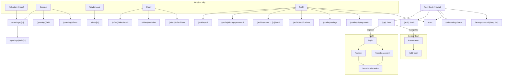

# Ekrany i nawigacja

Routing plikowy **Expo Router** w `src/app/`. Grupy tras w nawiasach nie występują w URL. Root layout (`_layout.tsx`) to `<Stack>` bez nagłówków z `initialRouteName: '(app)'`; rejestruje grupy `(app)`, `(auth)`, `(onboarding)`, `(profile)`, `(sparrings)`, `(offers)`, `(chat)` oraz ekran `rules`. Włączone `typedRoutes` (app.config.ts).

## Mapa tras

### Trasy najwyższego poziomu (poza grupami)

| Trasa | Plik | Opis |
|---|---|---|
| `/reset-password` | `reset-password.tsx` | Ustawienie nowego hasła z kodem resetu (deep link z e-maila); formularz TanStack Form + Zod, `Query.useResetPassword*` |
| `/rules` | `rules.tsx` | Regulamin aplikacji (statyczna treść PL) + widok logów powiadomień |
| `/*` (404) | `[...messing].tsx` | Catch-all „Not found" z linkiem do ekranu głównego |

### Grupa `(app)` — główna nawigacja (Tabs)

Layout: `Tabs` z 5 zakładkami. Strażnik: przy `status === 'signOut'` → `Redirect` na `/(auth)/login`; po zalogowaniu, gdy `user.numberTeamsForTheUser === 0` → `router.replace('/(onboarding)/create-team')`.

| Tab | Plik | Opis |
|---|---|---|
| Kalendarz (`index`) | `(app)/index.tsx` | Kalendarz miesięczny (`react-native-calendars`, locale PL, tydzień od poniedziałku) z listą sparingów w wybranym dniu; dane z `Query` (CalendarDto) |
| Sparingi | `(app)/sparrings.tsx` | Material Top Tabs: „Wszystkie" / „Moje"; przełącznik widoku lista/mapa, przycisk filtrów, FAB dodawania; stan tab/viewMode/filtry synchronizowany z parametrami URL (`useSparringUrlParams`) |
| Wiadomości | `(app)/messages.tsx` | Lista czatów (`InfiniteList`, IChatDto) z ostatnią wiadomością i statusem przeczytania; wejście do `/(chat)/[id]` |
| Oferty | `(app)/offers.tsx` | Lista ofert (`InfiniteList`, IOfferDto) z filtrami (kategoria, województwo) i przyciskiem dodania oferty |
| Profil | `(app)/profile.tsx` | Karta użytkownika + linki do ekranów grupy `(profile)`, regulaminu; wylogowanie (zeruje badge powiadomień) |

### Grupa `(auth)` — uwierzytelnianie (Stack)

| Trasa | Plik | Opis |
|---|---|---|
| `/login` | `(auth)/login.tsx` | Logowanie (e-mail + hasło) |
| `/register` | `(auth)/register.tsx` | Rejestracja konta |
| `/email-confirmation` | `(auth)/email-confirmation.tsx` | Ekran „sprawdź skrzynkę"; wariant treści wg param `type=register\|forgot` |
| `/forgot-password` | `(auth)/forgot-password.tsx` | Wysłanie e-maila resetującego hasło |

### Grupa `(onboarding)` — pierwszy zespół (Stack)

| Trasa | Plik | Opis |
|---|---|---|
| `/create-team` | `(onboarding)/create-team.tsx` | Ekran powitalny z CTA „Dodaj zespół" |
| `/add-team` | `(onboarding)/add-team.tsx` | Formularz zespołu (`TeamForm` z features/team-management), `Query.useCreateTeamMutation` |

### Grupa `(profile)` — ustawienia i profil (Stack)

| Trasa | Plik | Opis |
|---|---|---|
| `/edit` | `(profile)/edit.tsx` | Edycja danych profilu |
| `/change-password` | `(profile)/change-password.tsx` | Zmiana hasła |
| `/teams` | `(profile)/teams.tsx` | Lista zespołów użytkownika |
| `/teams/[id]` | `(profile)/teams/[id].tsx` | Szczegóły/edycja zespołu |
| `/teams/add` | `(profile)/teams/add.tsx` | Dodanie kolejnego zespołu |
| `/notifications` | `(profile)/notifications.tsx` | Lista powiadomień (sparingowe + systemowe), czas względny, oznaczanie przeczytanych |
| `/settings` | `(profile)/settings.tsx` | Ustawienia: motyw, powiadomienia, wersja aplikacji, debug force-update |
| `/display-mode` | `(profile)/display-mode.tsx` | Wybór motywu: system / jasny / ciemny |

### Grupa `(sparrings)` — sparingi (Stack)

| Trasa | Plik | Opis |
|---|---|---|
| `/add` | `(sparrings)/add.tsx` | Tworzenie sparingu (`SparringForm`), `Query.useCreateSparringMutation`; typ, cykl, lokalizacja (Location/Coordinate/Address) |
| `/[id]` | `(sparrings)/[id].tsx` | Szczegóły sparingu: top-tabs, lista uczestników, akcje (`SparringActions`), otwarcie lokalizacji w mapach |
| `/edit/[id]` | `(sparrings)/edit/[id].tsx` | Edycja sparingu |
| `/filters` | `(sparrings)/filters.tsx` | Filtry listy sparingów: wiek, poziom zespołu, województwo, daty (wynik wraca parametrami URL) |

### Grupa `(offers)` — oferty (Stack)

| Trasa | Plik | Opis |
|---|---|---|
| `/add-offer` | `(offers)/add-offer.tsx` | Dodanie oferty |
| `/offer-details` | `(offers)/offer-details.tsx` | Szczegóły oferty |
| `/offer-filters` | `(offers)/offer-filters.tsx` | Filtry ofert (kategoria, województwo) |

### Grupa `(chat)` — czat (Stack)

| Trasa | Plik | Opis |
|---|---|---|
| `/[id]` | `(chat)/[id].tsx` | Rozmowa (`react-native-gifted-chat`): wysyłanie (`SendMessageCommand`), oznaczanie przeczytanych (`MarkReadCommand`); param `type` (CHAT_TYPE) |

## Przepływy

- **Start / bootstrap:** natywny splash → `useBootstrap` (hydratacja auth, sprawdzenie OTA i minimalnej wersji) → `JsSplashScreen` znika; wymuszona aktualizacja pokazuje `ForceUpdateOverlay`.
- **Auth:** niezalogowany użytkownik jest przekierowany z `(app)` na `/login`; z logowania dostępne rejestracja i odzyskiwanie hasła; po rejestracji/reset-request ekran `email-confirmation`; link z e-maila prowadzi do `/reset-password`.
- **Onboarding:** po pierwszym zalogowaniu, gdy użytkownik nie ma zespołu, następuje przekierowanie do `(onboarding)`; po utworzeniu zespołu powrót do tabów.
- **Sparingi:** lista (tab) → filtry / szczegóły `[id]` → edycja; tworzenie przez FAB → `/add`.
- **Czat:** tab Wiadomości → `/(chat)/[id]`; do czatu prowadzą też akcje przy sparingu.
- **Powiadomienia push:** tap w powiadomienie nawiguje przez `expo-router` (obsługa w `entities/notification`); lista w `/(profile)/notifications`.

## Diagram nawigacji

